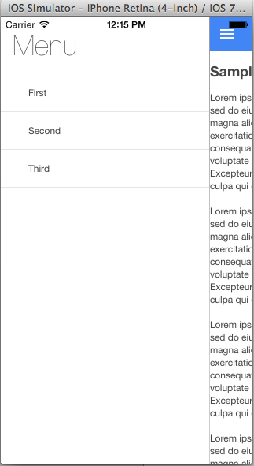

ng-side-menu
============

It contains a fully functional Cordova application that has a Side Menu with navigation.

The aim of this project was to extend the functionality demonstrated [here](https://github.com/jakiestfu/Snap.js/) by using angularjs, apache cordova and allowing navigation by clicking on the items within the side menu.

Changes has been made to navigation menu by taking the data from a JSON file, which can easly be modified.

## Running the app
For development purposes it's easiest to run with:

```bash
$ cordova platform add ios
$ cordova build
```

For more information regarding other platforms checkout this Cordova Platform Guide [here](http://cordova.apache.org/docs/en/3.5.0/guide_platforms_index.md.html#Platform%20Guides).

## Screenshots


 


